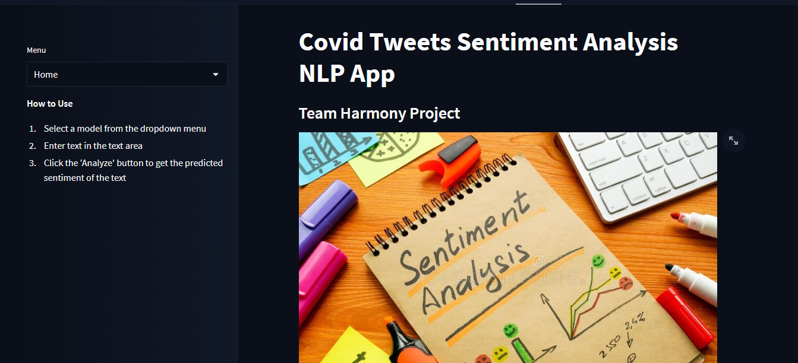

# Covid-Vaccine-tweets-classification-app

## About
This is a streamlit app for deep learning models to classifiy covid-19 vaccination tweets (positive,negative or neutral).

## Project Description

The "Covid-Vaccine-tweets-classification-app" is a Streamlit web application that uses pre-trained models from Huggingface to classify the sentiment of tweets related to Covid-19 vaccines. The app allows users to enter a keyword or phrase related to Covid-19 vaccines and displays the sentiment analysis of the resulting tweets in real-time. The models used in the app include BERT, RoBERTa, and DistilBERT, which are state-of-the-art natural language processing models. The app also includes a visualization of the sentiment analysis results, allowing users to easily see the distribution of positive, negative, and neutral tweets related to Covid-19 vaccines.


## Summary
| Code      | Name        | Published Article |  Deployed App |
|-----------|-------------|:-------------:|------:|
| LP5       |covid-19 vaccination tweet classification app|[sentiment analysis article](https://medium.com/@peninarandu/sentiment-analysis-of-covid-19-tweets-by-hugging-face-deep-learning-models-8818859792f1) | [Tweet classification app](https://huggingface.co/spaces/Pendo/Covid_tweet_sentiment_analysis)

## Setup
Install the required packages to be able to run the evaluation locally.

You need to have Python3 on your system. Then you can clone this repo and being at the repo's root (root :: repo_name> ...) follow the steps below:

Windows:

 ```bash
 python -m venv venv; venv\Scripts\activate; python -m pip install -q --upgrade pip; python -m pip install -qr requirements.txt 
 ``` 
Linux & MacOs:

  ```bash
  python3 -m venv venv; source venv/bin/activate; python -m pip install -q --upgrade pip; python -m pip install -qr requirements.txt
  ```  
The both long command-lines have a same structure, they pipe multiple commands using the symbol ; but you may manually execute them one after another.

1.`Create the Python's virtual environment` that isolates the required libraries of the project to avoid conflicts;

2.`Activate the Python's virtual environment` so that the Python kernel & libraries will be those of the isolated environment;

3.`Upgrade Pip, the installed libraries/packages manager` to have the up-to-date version that will work correctly;

4.`Install the required libraries/packages` listed in the `requirements.txt` file so that it will be allow to import them into the python's scripts and notebooks without any issue.

NB: For MacOs users, please install Xcode if you have an issue.
##  Usage
Download or Clone the repository and navigate to the project directory. Clone this repository to your local machine using the following command:

https://huggingface.co/spaces/Pendo/Covid_tweet_sentiment_analysis

##  Execution
To run the app, use this command;
```bash
  streamlit run NLPapp.py
```
Replace NLPapp.py with the name of your .py file.


## Contribution 
Contributions and pull requests are welcome! If you would like to contribute to this project, please follow these steps:

1.Fork this repository.
2.Create a new branch with a descriptive name
3.Make your desired changes and commit them.
4.Push the branch to your forked repository
5.Open a pull request in this repository and describe your changes.

Feel free to contribute to different aspects of the project.

## Author
Penina Pendo

